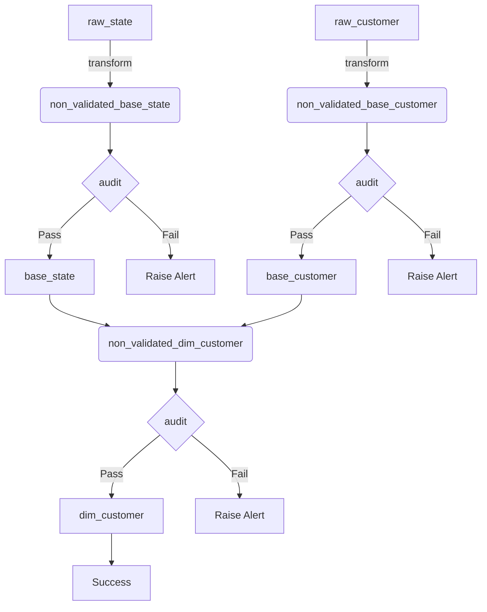

* [1. Setup](#1-setup)
    * [1.1. Github Codespaces](#11-github-codespaces)
    * [1.2. Locally with virtual environment](#12-locally-with-virtual-environment)
    * [1.3. Create the tables necessary for the ETL](#13-create-the-tables-necessary-for-the-etl)
* [2. Run ETL](#2-run-etl)
* [3. Test ETL output](#3-test-etl-output)
* [4. Validation results](#4-validation-results)

Code for the blog: **[How to implement data quality checks with greatexpectations](https://www.startdataengineering.com/post/implement_data_quality_with_great_expectations/)**

## 1. Architecture

Our project involves building a `dim_customer` table from `raw_customer` and `raw_state` tables. We use `sqlite3` as our data warehouse. The data flow architecture is pictured below:


## 2. Setup

You can run this via 

### 2.1. Github Codespaces

Simply click on this **[link](https://github.com/codespaces/new?skip_quickstart=true&machine=basicLinux32gb&repo=835341653&ref=main&geo=UsEast)** and you will be able to run your own code space with this repository. Wait for a few minutes for codespaces to install all the packages in **[requirements.txt](./requirements.txt)**.

:heavy_exclamation_mark: **Caution**: Codespaces only have limited free availability

### 2.2. Locally with virtual environment

You can clone this repo and setup a virtual environment to run the code. You will need [Python >= 3.10](https://www.python.org/downloads/) and [git](https://git-scm.com/downloads) installed.

```bash
git clone https://github.com/josephmachado/data-quality-w-greatexpectations.git
cd data-quality-w-greatexpectations
python -m venv ./env               
source env/bin/activate # use virtual environment
pip install -r requirements.txt
```

### 2.3. Create the tables necessary for the ETL

Once you have the environment ready (either via codespaces or locally), run the setup script that **[creates tables](./setup/1-create-tables.sql)**, and **[inserts data](./setup/2-populate-raw-tables.sql)** into them.

```bash
# in the data-quality-w-greatexpectations folder
./setup.sh
```

## 3. Run ETL

With the tables setup, you can run the ETL with the following command:

```bash
# in the data-quality-w-greatexpectations folder
python ecommerce/ecommerce/dim_customer_etl.py
```

This will run the ETL along with the **[greatexpectations validations](./ecommerce/ecommerce/gx/expectations/)**.

## 4. Test ETL output

You can check that the ETL output is present with the following command.

```bash
sqlite3 ecommerce.db < ./setup/3-check-count.sql 
```

The above query should return

```text
110
110
27
```

## 5. Validation results

The results of the validations will be stored in the `./ecommerce/ecommerce/gx/uncommitted/validations/dim_customer_dt_created_count/__none__`.

Since the `uncommitted` folder is not included in the git repo, you will need to run the ETL atleast once for this folder to appear.

